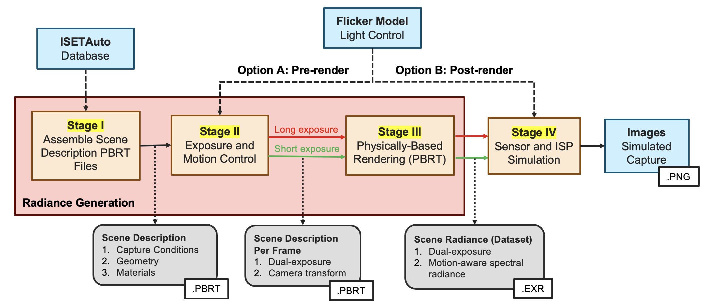
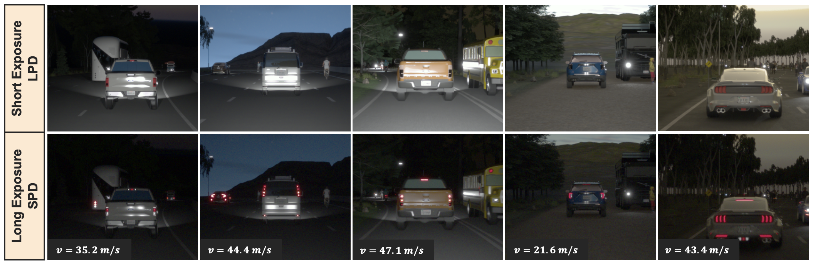

# ISET-LFM: A Physics-based Simulation Framework and Dataset for LED Flicker

This repository contains the official code and dataset for the paper:  
**"A Physics-based Simulation Framework and Dataset for LED Flicker in Automotive Imaging"** Accepted at the **Electronic Imaging (EI) 2026** conference.

*Paper Link*: [TO BE ADDED]()  
*Dataset Link*: [Stanford Digital Repository](https://purl.stanford.edu/wd776hn7919)

---

## 1. Introduction
LED flicker is a persistent artifact in automotive imaging where lights modulated via Pulse Width Modulation (PWM) produce temporal intensity variations in captured video. Our framework provides an open-source, physics-based simulation pipeline that integrates an analytical PWM flicker model with active camera transforms to simulate realistic motion blur and flicker artifacts.

  
*Figure 1: The ISET-LFM Simulation Framework—from 3D scene assembly and ego-motion control to split-pixel sensor modeling.*

  
*Figure 2: Sample scenes from the dataset illustrating the motion-flicker trade-off. Top row (LPD) shows short-exposure flickering; bottom row (SPD) shows long-exposure signal recovery with motion blur at various ego-velocities (v).*

---

## 2. Dataset
We provide a camera-agnostic dataset of 200 automotive scenes for the prominence of LED sources. The dataset utilizes a **post-render light control (Option B)** approach (described in the paper), enabling researchers to modulate flicker parameters post-rendering.

### Organization
The dataset is organized by `SceneID`. Each folder contains decomposed light group radiance maps (EXR) to facilitate flexible sensor simulation (by combining these light groups with different weights):

```text
dataset/
└── <SceneID>/
    ├── <SceneID>_{lightgroup}/   # {headlights, streetlights, otherlights, skymap}
    │   ├── lpd/                  # Short-exposure (3–5 ms) radiance; 3 frames
    │   │   ├── 01.exr ... 03.exr
    │   └── spd/                  # Long-exposure (11.11 ms) radiance; 3 frames
    │       ├── 01.exr ... 03.exr
    ├── <SceneID>_lf.mat          # Metadata: Depth map, LPD exposure (3-5ms), and velocity (20-50m/s)
    └── <SceneID>_skymap.png      # Thumbnail: Quick-view using the skymap image

```

## 3. Dependencies
To utilize the post-render light control and sensor simulation, the following toolboxes are required:

* **[ISETCam](https://github.com/ISET/isetcam)**: Core image system simulation and sensor modeling.
* **[isethdrsensor](https://github.com/ISET/isethdrsensor)**: Specialized support for light group control, split-pixel and multi-exposure HDR sensor architectures.
* **(Optional) [iset3d-tiny](https://github.com/ISET/iset3d-tiny)**: Required only if you intend to run pre-render (Option A) light control.

---

## 4. How to Use
The framework is designed for use in **MATLAB (tested on R2024b)**. Note that the MATLAB UI is required for ISETCam visualization components (`ipWindow`).

### Dataset Processing (Post-render Option B)
We utilize the post-render light control approach to enable researchers to modulate flicker parameters (such as duty cycle and frequency) after the ray-tracing step.

1.  **Download the Dataset**: Place the `<SceneID>` directories in your `iset-lfm/local/` data folder.
2.  **Set Paths**: Add the `scripts/` folder and the required dependencies mentioned above to your MATLAB path.
3.  **Run the Simulation**: Execute the main processing script for a specific scene:
    ```matlab
    % sceneID: Unique ID of the scene (e.g., '1112154733')
    % Nframes: Number of frames to process (maximum 3 available in dataset)
    lf_RunCam_LightCtrl(sceneID, Nframes)
    ```

---

## Citation
If you use this framework or dataset in your research, please cite our EI 2026 paper:

```bibtex
TO BE ADDED
```

## Acknowledgements
This work was primarily developed during an internship at Omnivision Technologies. I am deeply grateful to Dr. Ramakrishna Kakarala for his technical guidance and mentorship. Special thanks to Prof. Brian Wandell for providing access to the Stanford VISTA Lab’s computational resources and the ISETAuto database. This research was built upon the robust foundation of the ISET open-source ecosystem.


